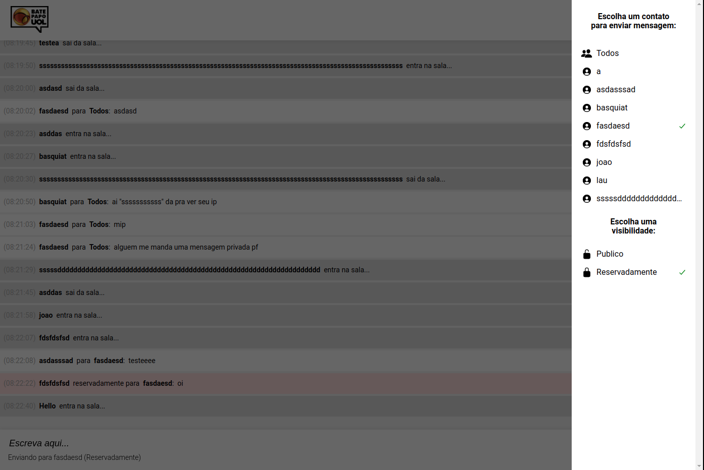

# Chat room

The goal of this project is to create an online chat client that connects to the API provided by respondeAi. Upon loading the page, the user can type out a unique username to join the chat room. The user can send direct messages to any other user in the chat room or to all other users. It is also possible to make those messages either private or public. Notes about the implementation:

- Selecting oneself as the recipient is disabled
- If the recipient leaves the room, the code won't automatically change the recipient in order to prevent sensitive private messages from being sent by accident.
- It is possible to select a recipient by clicking their name in bold on the chat body. But if they are no longer in the room, nothing will happen. 

To achieve this, the project makes use of HTML5, CSS3, vanilla JavaScript and the API provided by respondeAi.

## Built With

- HTML5 , CSS3 , JavaScript
- Windows, Linux

## Live Demo

[Live Demo Link](https://vitorelourenco.github.io/chat-room/)

## Authors

👤 **Vitor Emanuel Lourenco**

- GitHub: [@vitorelourenco](https://github.com/vitorelourenco)
- Twitter: [@Vitorel](https://twitter.com/Vitorel)
- LinkedIn: [vitoremanuellourenco](https://www.linkedin.com/in/vitoremanuellourenco/)

## 🤝 Contributing

Contributions, issues, and feature requests are welcome!

Feel free to check the [issues page](https://github.com/vitorelourenco/chat-room/issues).

## Show your support

Give a ⭐️ if you like this project!

## Acknowledgments

- RespondeAi (https://www.respondeai.com.br/)
- The Odin Project (https://www.theodinproject.com/)

## 📝 License

This project is [MIT](lic.url) licensed.

